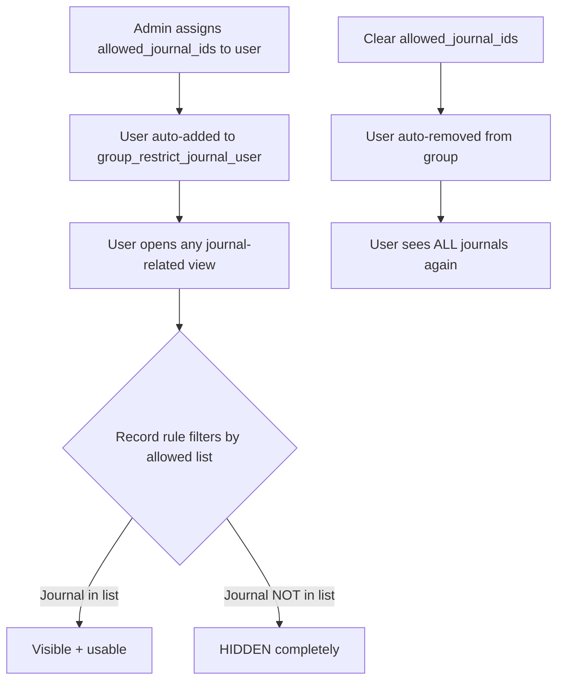
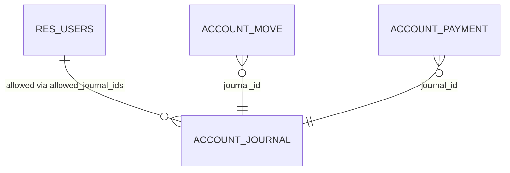
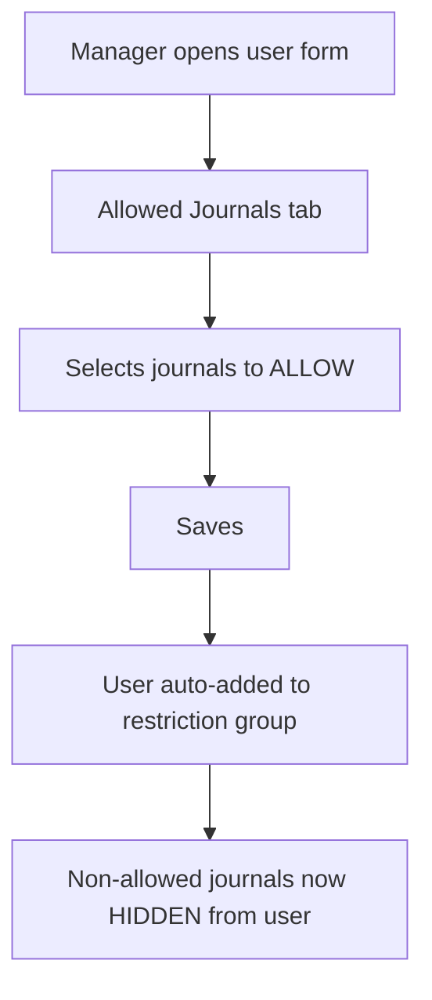

# el_restrict_journal — Restrict Journal for Users (Whitelist Mode)

Per-user journal **whitelist** for Odoo 19. Admins select which journals each user is **ALLOWED** to use; the user will then **ONLY** see and use those journals. All other journals are **COMPLETELY HIDDEN** (not just read-only — invisible in lists, dropdowns, and search).

## Architecture Overview



## ER Diagram



## How It Works (Whitelist Semantics)

| State | What User Sees |
|-------|---------------|
| `allowed_journal_ids` is **empty** | ALL journals (unrestricted — default Odoo behavior) |
| `allowed_journal_ids` has **1+ journals** | ONLY those journals — all others are HIDDEN |

When admin adds journals to `allowed_journal_ids`:
1. The user is **automatically added** to `group_restrict_journal_user`
2. Record rules activate and hide all non-allowed journals
3. Python overrides block any create/write attempt with non-allowed journals

When admin clears `allowed_journal_ids`:
1. The user is **automatically removed** from `group_restrict_journal_user`
2. Record rules no longer apply
3. User sees all journals again (back to default Odoo behavior)

## Features

- **Whitelist enforcement** — only allowed journals are visible
- **Complete hiding** — non-allowed journals are invisible (not just read-only)
- **Auto group management** — adding/clearing the list auto-manages group membership
- **Defense in depth** — 3 layers of enforcement:
  1. UI onchange (immediate feedback)
  2. Record rules (ORM-level hiding)
  3. Python overrides + `@api.constrains` (last line of defense)
- **Privilege escalation prevention** — only managers can edit `allowed_journal_ids`
- **Backwards compatible** — empty list = unrestricted user (default Odoo behavior)
- **Arabic translations** included

## Installation

1. Copy the `el_restrict_journal` folder to your Odoo `addons` directory.
2. Restart Odoo with `-u el_restrict_journal` (or install via the Apps menu).
3. Go to **Settings → Users → (select user) → Allowed Journals tab** to configure.

## Configuration



### Steps

1. **Assign the Manager group** to the chief accountant:
   - Settings → Users → select user → Access Rights → "Restricted Journal: Manager"
2. **Open the user form** for the accountant you want to restrict.
3. **Go to the "Allowed Journals" tab.**
4. **Add the journals** this user should be ALLOWED to use.
5. **Save.** The user now only sees those journals.

To remove the restriction: clear the Allowed Journals list and save. The user regains full access.

## Usage

Once configured with a non-empty allowed list, restricted users will:

- **See ONLY allowed journals** in lists, dropdowns, and search results.
- **Be blocked** from selecting non-allowed journals (warning popup if they somehow try).
- **Get a `ValidationError`** if they try to create/write with a non-allowed journal.

Admin users (with empty `allowed_journal_ids`) see ALL journals — never restricted.

## Testing

14 unit tests covering all enforcement layers:

```bash
# Run all tests
odoo -d <db> -i el_restrict_journal --test-enable --test-tags=/el_restrict_journal --stop-after-init
```

**Test Results:** ✅ 14/14 PASS (0 failed, 0 errors) on Odoo 19 + PostgreSQL 16

## Documentation

Full documentation lives in `docs/`:

- `docs/requirements-specification.md` — Full requirements spec
- `docs/stakeholder-analysis.md` — Stakeholder matrix + RACI
- `docs/architecture/` — Architecture documents
- `docs/runtime-test-report.md` — L1/L2 runtime validation results
- `docs/build-report.md` — Build quality report
- `docs/user-acceptance-preview.md` — User acceptance walkthrough
- `docs/security.md` — Security architecture
- `docs/testing.md` — Test plan
- `docs/configuration.md` — Configuration guide

## Compatibility

- **Odoo 19** (primary target — verified via runtime L1+L2)
- **Odoo 18** (should work — same APIs)
- **Odoo 17** (untested — `@api.model_create_multi` available since 17.0)

## License

LGPL-3

## Author

Ibrahim Elmasry

## Version

19.0.2.0.0 (Whitelist mode — inverted from v1.0.0 blacklist)
