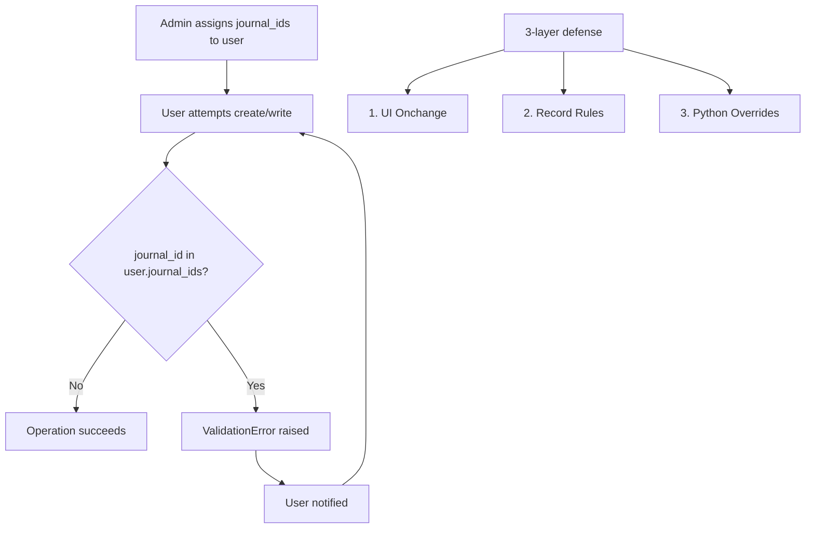
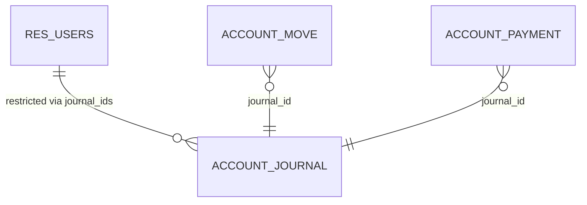
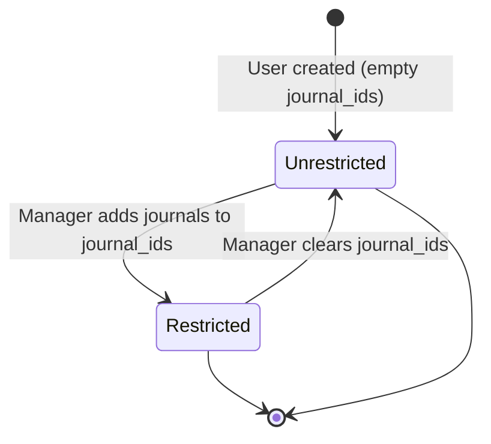
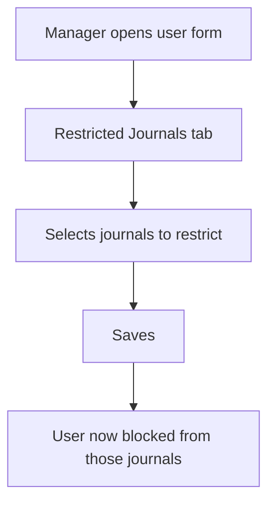

# el_restrict_journal — Restrict Journal for Users

Per-user journal restriction for Odoo 19. Admins can mark specific account journals as "restricted" for selected users; those users will be unable to create or modify accounting entries in restricted journals.

## Architecture Overview



## ER Diagram



## State Machine (Configuration Lifecycle)



## Features

- **Per-user journal restriction** via `res.users.journal_ids` Many2many field
- **Defense in depth** — 3 layers of enforcement:
  1. UI onchange (immediate feedback)
  2. Record rules (ORM-level filtering)
  3. Python overrides + `@api.constrains` (last line of defense)
- **Read-only visibility** — restricted journals remain visible as read-only (users can read existing entries)
- **Privilege escalation prevention** — only managers can edit `journal_ids`
- **Backwards compatible** — empty `journal_ids` = unrestricted user (default Odoo behavior preserved)
- **Arabic translations** included

## Installation

1. Copy the `el_restrict_journal` folder to your Odoo `addons` directory.
2. Restart Odoo with `-u el_restrict_journal` (or install via the Apps menu).
3. Go to **Settings → Users → (select user) → Restricted Journals tab** to configure restrictions.

## Configuration



### Steps

1. **Assign the Manager group** to the chief accountant:
   - Settings → Users → select user → Access Rights → "Restricted Journal: Manager"
2. **Open the user form** for the accountant you want to restrict.
3. **Go to the "Restricted Journals" tab.**
4. **Add the journals** this user should NOT be able to use.
5. **Save.** The user is now restricted from those journals.

## Usage

Once configured, restricted users will:

- **See restricted journals** as read-only in lists (so they can reference existing entries).
- **Be blocked** from selecting restricted journals in new `account.move` or `account.payment` records — they get an immediate warning popup.
- **Be blocked** from changing an existing record's journal to a restricted one — they get a `ValidationError`.

Admin users (with empty `journal_ids`) are NEVER restricted.

## Security

| Group | Purpose |
|-------|---------|
| `el_restrict_journal.group_restrict_journal_user` | Implicit group for users who may have restrictions applied (record rules apply) |
| `el_restrict_journal.group_restrict_journal_manager` | Can configure restrictions on user forms |

See `docs/architecture/security-review.md` for the full security architecture.

## Testing

13 unit tests covering all enforcement layers:

```bash
# Run all tests
odoo -d <db> -i el_restrict_journal --test-enable --test-tags=/el_restrict_journal --stop-after-init
```

See `docs/testing.md` for the full test plan.

## Documentation

Full documentation lives in `docs/`:

- `docs/requirements-specification.md` — Full requirements spec
- `docs/stakeholder-analysis.md` — Stakeholder matrix + RACI
- `docs/architecture/` — Architecture documents (9 files)
- `docs/runtime-test-report.md` — L1/L2 runtime validation results
- `docs/build-report.md` — Build quality report
- `docs/user-acceptance-preview.md` — User acceptance walkthrough
- `docs/icon-design.md` — Icon design rationale
- `docs/testing.md` — Test plan

## Compatibility

- **Odoo 19** (primary target — verified via runtime L1+L2)
- **Odoo 18** (should work — same APIs)
- **Odoo 17** (untested — `@api.model_create_multi` available since 17.0)
- **Odoo 16 and below** — NOT supported (different onchange API)

## License

LGPL-3

## Author

Ibrahim Elmasry
