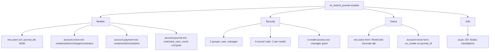
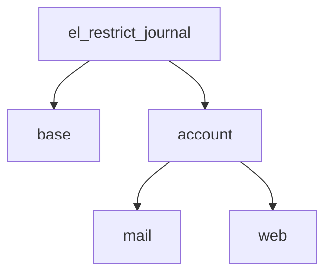

# Architecture — el_restrict_journal

## High-Level Architecture



## Design Principles

1. **Defense in depth** — 3 enforcement layers (UI onchange + record rules + Python overrides)
2. **Backwards compatible** — Empty `journal_ids` = unrestricted (default Odoo behavior)
3. **Additive only** — No breaking changes to existing flows
4. **Reversible** — Uninstall cleanly removes all overrides
5. **Auditable** — Every blocked operation raises a logged exception

## Module Dependencies



## Files

```
el_restrict_journal/
├── __init__.py
├── __manifest__.py
├── .gitignore
├── README.md
├── doc/
│   └── (architecture docs - 9 files)
├── docs/
│   ├── README.md (this file's parent)
│   ├── requirements-specification.md
│   ├── stakeholder-analysis.md
│   ├── runtime-test-report.md
│   ├── build-report.md
│   ├── user-acceptance-preview.md
│   ├── icon-design.md
│   ├── testing.md
│   ├── models.md
│   ├── workflows.md
│   ├── views.md
│   ├── security.md
│   └── architecture/
│       ├── _inventories.md
│       ├── model-design.md
│       ├── state-machine-design.md
│       ├── dependencies-map.md
│       ├── data-flow.md
│       ├── impact-analysis.md
│       ├── gap-analysis.md
│       ├── alignment-decision.md
│       ├── creative-design.md
│       ├── security-review.md
│       └── performance-review.md
├── i18n/
│   └── ar.po
├── models/
│   ├── __init__.py
│   ├── res_users.py
│   ├── account_move.py
│   ├── account_payment.py
│   └── account_journal.py
├── security/
│   ├── account_restrict_journal_groups.xml
│   ├── ir.model.access.csv
│   └── account_restrict_journal_rules.xml
├── static/
│   └── description/
│       └── icon.png
├── tests/
│   ├── __init__.py
│   └── test_restrict_journal.py
└── views/
    ├── res_users_views.xml
    └── account_move_views.xml
```
