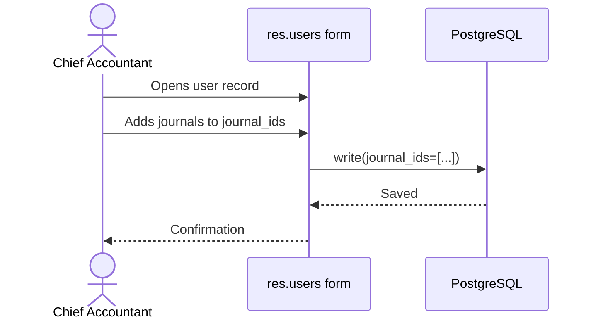
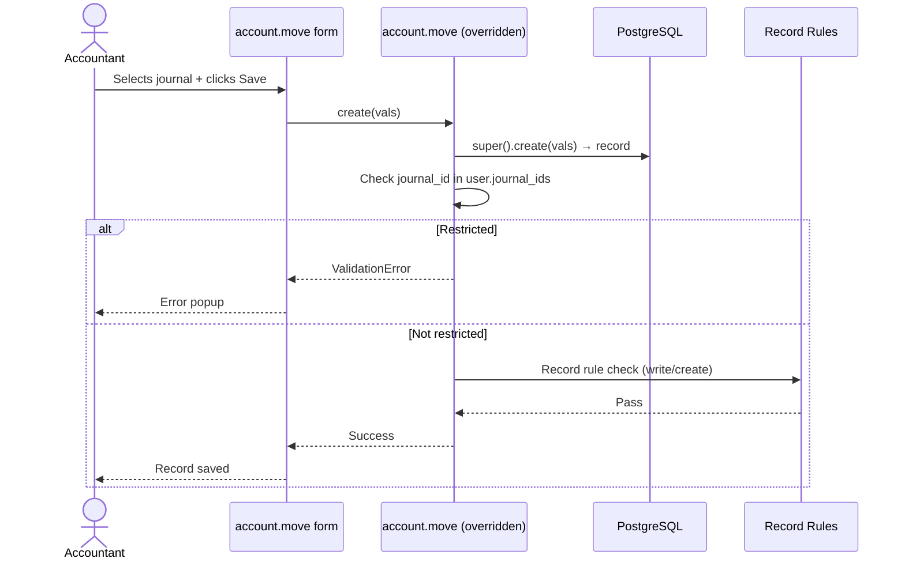
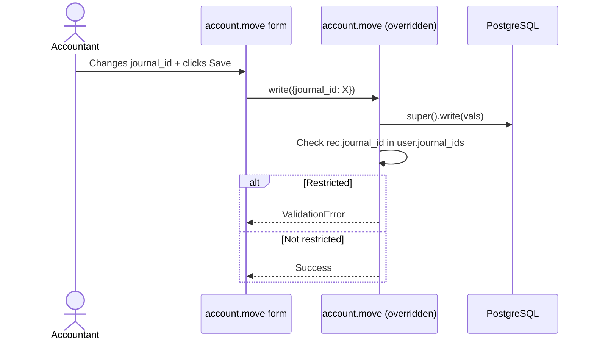
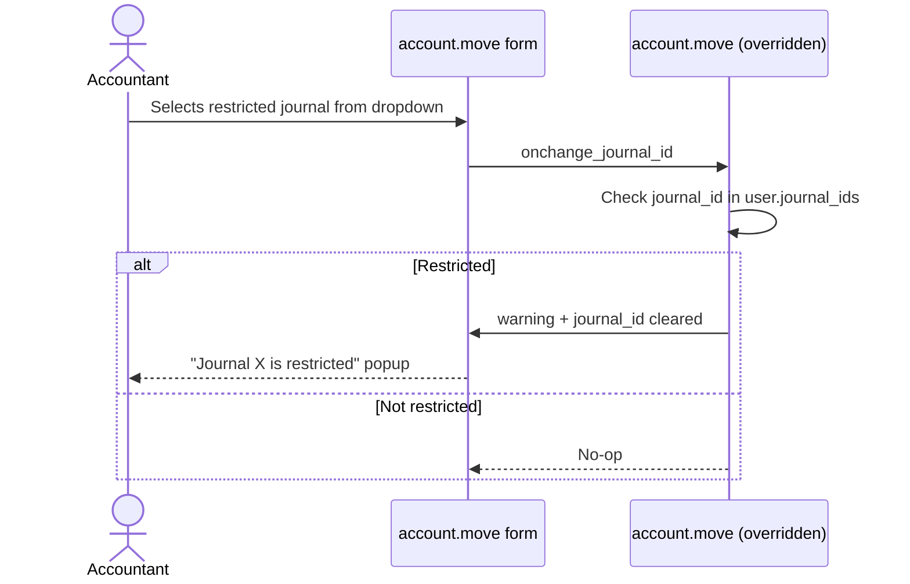
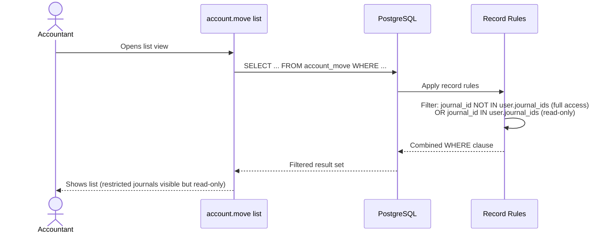

# Data Flow — el_restrict_journal

## 1. Configuration Flow

## 2. account.move Create Flow

## 3. account.move Write Flow

## 4. Onchange UX Flow (immediate feedback)

## 5. List View Read Flow (record rule enforcement)

## 6. Critical Path: Defense in Depth

The restriction is enforced at **3 layers**, in order:

| Layer | Where | What | Bypassable? |
|-------|-------|------|-------------|
| 1 | UI Onchange | Clears journal_id + warning popup | Yes — user can disable JS |
| 2 | Record Rules | Filters list views, blocks write/create/unlink at ORM level | Hard (requires admin SQL) |
| 3 | Python Override + Constrains | `ValidationError` in `create`/`write`/constrains | No (without uninstall) |

A user who tries to bypass layer 1 (UI) will hit layer 2 (record rule blocks the operation at the ORM level). Even if they bypass layer 2 (via raw SQL or admin tools), layer 3 (Python constrains) catches the violation on the next `flush()` of the record.
