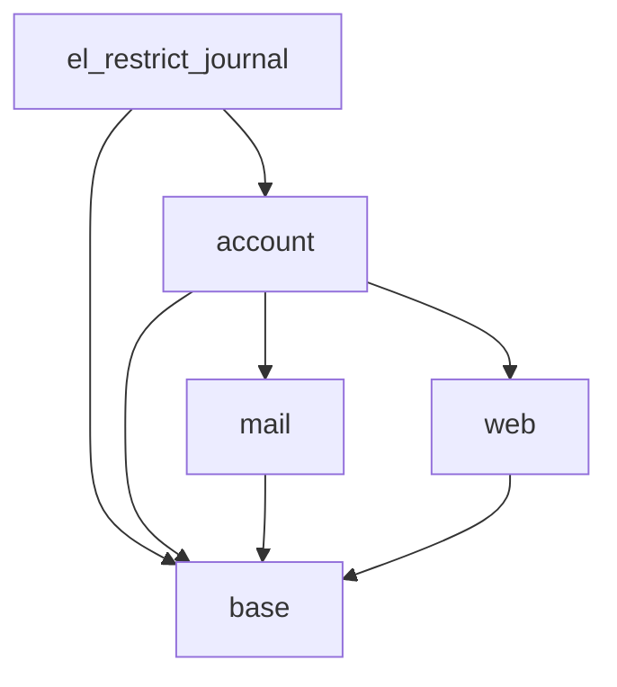

# Dependencies Map — el_restrict_journal

## Direct Dependencies

| Module | Required | Reason |
|--------|----------|--------|
| `base` | Yes | Required for all modules; provides `res.users` |
| `account` | Yes | Provides `account.move`, `account.payment`, `account.journal` |

## Transitive Dependencies (via `account`)

| Module | Required | Reason |
|--------|----------|--------|
| `mail` | Yes (via account) | Chatter, mail.thread |
| `web` | Yes (via account) | Web assets, QWeb |
| `base` | Yes (via account) | Core models |

## Dependency Graph

## Explicitly NOT Dependent On

| Module | Reason |
|--------|--------|
| `account_payment` | (Sub-module of `account` in Odoo 17+ — included transitively) |
| `sale` | Not needed — restriction works on accounting entries regardless of origin |
| `purchase` | Not needed — same reason |
| `hr_payroll` | Not needed — restriction is journal-level, not document-level |
| `account_edi` | Not needed — restriction is independent of EDI |

## Multi-Version Compatibility

| Odoo Version | Status | Notes |
|--------------|--------|-------|
| 19 | ✅ Target | Primary target |
| 18 | ✅ Should work | Same APIs — `@api.model_create_multi` exists; `journal_id` field exists |
| 17 | ⚠ Untested | `@api.model_create_multi` available since 17.0 — should work |
| 16 | ❌ Not supported | Different onchange API |

## Conflict Analysis

No conflicts expected — this module only:
1. Adds one M2M field to `res.users` (no name clash risk)
2. Overrides `create`/`write` on `account.move` and `account.payment` (uses `super()` chain — cooperates with other extensions)
3. Adds record rules (additive — never conflicts with existing rules)

If another module also overrides `account.move.create`, both overrides will be chained by Odoo's MRO. The restriction check happens after `super().create()` so it sees the final state of the record — no race condition with other extensions.
