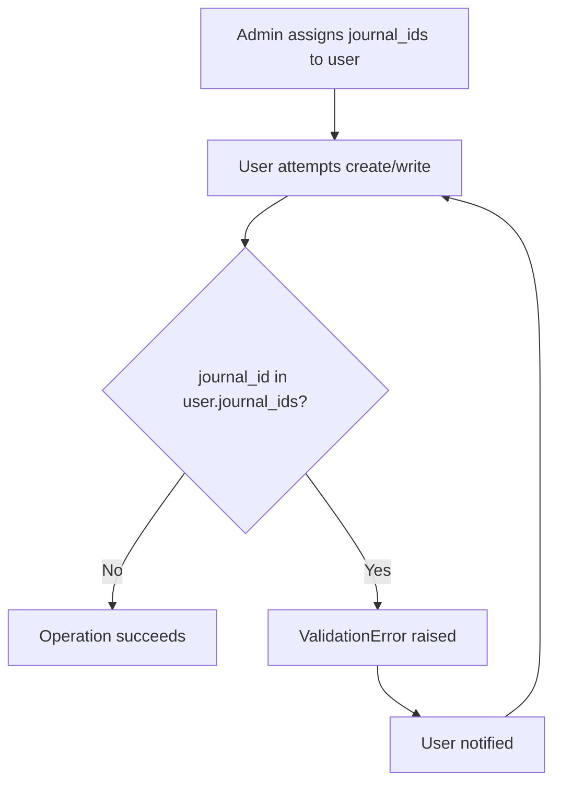

# State Machine Design — el_restrict_journal

## Not Applicable

This module is a **security/enforcement** module, not a workflow module. There are no state machines.

The only "state" change is the `journal_ids` Many2many on `res.users` — journals can be added or removed from a user's restricted list at any time by a manager. There is no workflow transition; the restriction is enforced on every `create`/`write` operation.

## Diagram

