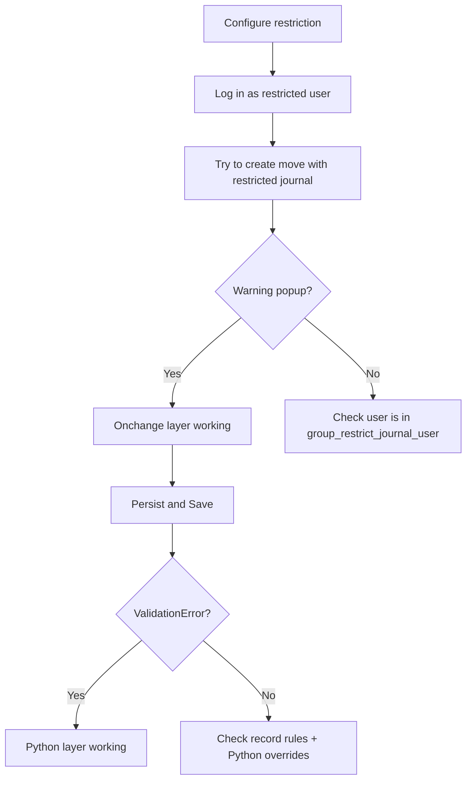

# Configuration Guide — el_restrict_journal

## 1. Post-Install Configuration

After installing `el_restrict_journal`:

### Step 1: Assign Manager Group to Chief Accountant

1. Go to **Settings → Users → (select chief accountant)**
2. Click **Access Rights** tab
3. Under **Restrict Journal** section, select **Manager**
4. Click **Save**

### Step 2: Configure Restrictions per User

1. Go to **Settings → Users → (select accountant to restrict)**
2. Click **Restricted Journals** tab (visible only to managers)
3. Click into the **Restricted Journals** field
4. Select the journals this user should NOT be able to use
5. Click **Save**

### Step 3: Verify the Restriction

1. Log in as the restricted accountant (or impersonate them)
2. Try to create a new invoice/bill/journal entry with the restricted journal
3. You should see a warning popup immediately (onchange)
4. If you persist and click Save, you'll get a `ValidationError`

## 2. Multi-Company Considerations

- `account.journal` is multi-company by default (Odoo core)
- The `journal_ids` M2M field will only show journals from the user's allowed companies
- No additional multi-company configuration needed

## 3. Removing a Restriction

To remove a restriction:
1. Open the user form
2. Go to **Restricted Journals** tab
3. Click the **X** next to the journal you want to un-restrict
4. Click **Save**

The user immediately regains full access to that journal.

## 4. Bulk Configuration

For bulk configuration (restrict 50+ users at once), use the standard Odoo user list view:
1. Go to **Settings → Users**
2. Select multiple users via the list view checkboxes
3. Click **Action → Configure Restrictions** (not implemented in v1.0 — use individual user forms for now)

## 5. Verifying Restrictions are Working

