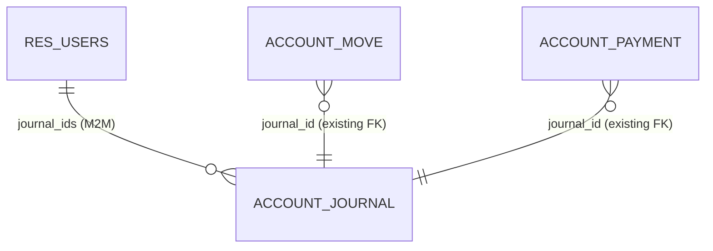

# Models — el_restrict_journal

## 1. res.users (extension)

```python
class ResUsers(models.Model):
    _inherit = "res.users"

    journal_ids = fields.Many2many(
        comodel_name="account.journal",
        relation="el_restrict_journal_users_rel",
        column1="user_id",
        column2="journal_id",
        string="Restricted Journals",
        help="Journals this user is NOT allowed to create or modify entries in.",
    )
```

### Field: `journal_ids`

| Property | Value |
|----------|-------|
| Type | Many2many → account.journal |
| Relation table | `el_restrict_journal_users_rel` |
| String | "Restricted Journals" |
| Stored | Yes (M2M is always stored) |
| Computed | No |
| Required | No |
| Default | Empty (no restriction) |
| Groups | (none — visibility controlled by view-level groups on the form page) |

### Method: `write(vals)` (override)

Prevents non-managers from editing `journal_ids`:

```python
def write(self, vals):
    if "journal_ids" in vals and not self.env.user.has_group(
        "el_restrict_journal.group_restrict_journal_manager"
    ):
        if not self.env.is_admin():
            raise AccessError(
                "You cannot modify the Restricted Journals field. ..."
            )
    return super().write(vals)
```

## 2. account.move (extension)

Overrides `create`, `write`, and adds `_onchange_journal_id` + `_check_journal_not_restricted` constrains.

### Methods

| Method | Decorator | Purpose |
|--------|-----------|---------|
| `create(vals_list)` | `@api.model_create_multi` | Block create with restricted journal |
| `write(vals)` | — | Block write when journal_id changes to restricted |
| `_onchange_journal_id()` | `@api.onchange('journal_id')` | UI: clear journal + show warning popup |
| `_check_journal_not_restricted()` | `@api.constrains('journal_id')` | Defense-in-depth: catches direct ORM writes |

## 3. account.payment (extension)

Same pattern as account.move: `create`, `write`, and `_check_journal_not_restricted` constrains.

## 4. account.journal (extension)

Adds a computed `restricted_user_count` Integer field (for future smart-button use — currently not displayed in views).

## ER Diagram


