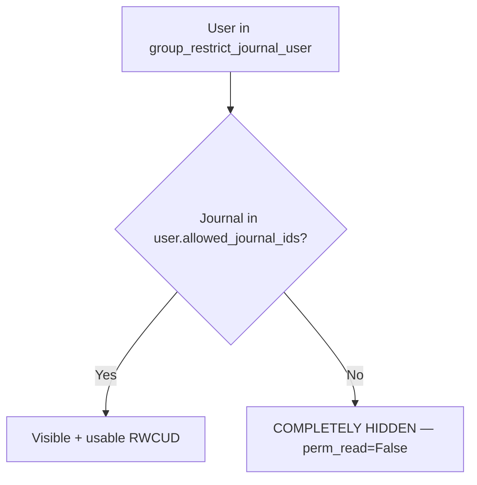
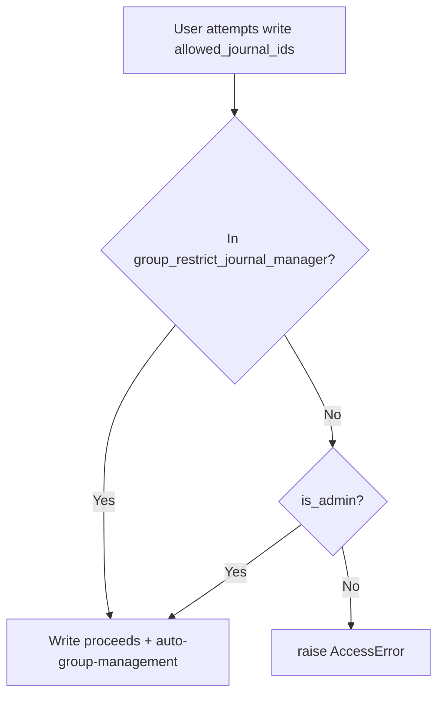

# Security — el_restrict_journal (Whitelist Mode)

## 1. Groups

| Group XML ID | Name | Auto-Managed? | Purpose |
|--------------|------|---------------|---------|
| `group_restrict_journal_user` | Restricted Journal: User (Whitelist Active) | YES — auto-added when `allowed_journal_ids` non-empty; auto-removed when cleared | Activates record rules that hide non-allowed journals |
| `group_restrict_journal_manager` | Restricted Journal: Manager | NO — manually assigned | Can configure allowed journals on user forms |

**Key difference from blacklist mode:** `group_restrict_journal_user` does NOT imply `base.group_user`. It is only assigned when a user has a non-empty `allowed_journal_ids` list. This way, the default state (empty list) does NOT hide all journals.

## 2. Record Rules (Whitelist — HIDE non-allowed)



Only ONE rule per model (not two like blacklist mode):

| Rule ID | Model | Domain | Perms |
|---------|-------|--------|-------|
| `rule_journal_allowed_only` | account.journal | `[('id', 'in', user.allowed_journal_ids.ids)]` | RWCUD (only matches allowed) |
| `rule_move_allowed_only` | account.move | `[('journal_id', 'in', user.allowed_journal_ids.ids)]` | RWCUD |
| `rule_payment_allowed_only` | account.payment | `[('journal_id', 'in', user.allowed_journal_ids.ids)]` | RWCUD |

**Effect:** A single rule with domain `('id', 'in', ...)` allows ONLY matching records. Non-matching records are invisible (perm_read=False implicitly because the rule's domain excludes them).

## 3. Auto Group Membership Logic

```python
def write(self, vals):
    res = super().write(vals)
    if "allowed_journal_ids" in vals:
        group_user = self.env.ref("el_restrict_journal.group_restrict_journal_user")
        for user in self:
            if user.allowed_journal_ids:
                # Non-empty whitelist → user should be in the group
                if group_user not in user.group_ids:
                    user.sudo().write({"group_ids": [(4, group_user.id)]})
            else:
                # Empty whitelist → user should NOT be in the group
                if group_user in user.group_ids:
                    user.sudo().write({"group_ids": [(3, group_user.id)]})
    return res
```

## 4. Python Enforcement Flow

```mermaid
flowchart TD
    A[account.move.create/write] --> B[super().create/write]
    B --> C{user.allowed_journal_ids empty?}
    C -->|Yes| D[Skip check — unrestricted]
    C -->|No| E{rec.journal_id in user.allowed_journal_ids?}
    E -->|Yes| F[Operation succeeds]
    E -->|No| G[raise ValidationError]
```

## 5. Privilege Escalation Prevention

The `res.users.write()` override blocks non-managers from editing `allowed_journal_ids`:



## 6. Access Rights (ir.model.access.csv)

| Model | Group | Perms |
|-------|-------|-------|
| res.users | base.group_system (admin) | RWCD |
| res.users | group_restrict_journal_manager | RW (no create/delete) |

## 7. Why Hiding (Not Read-Only) Matters

In whitelist mode, the user requirement is:
> "اللي مخترتوش ميظهرش لليوزر اصلا" (What I didn't select should not appear to the user at all)

This is achieved by using a SINGLE record rule per model with domain `('journal_id', 'in', user.allowed_journal_ids.ids)`:
- Records matching the domain are visible (RWCUD)
- Records NOT matching the domain are completely invisible (not even readable)

This is different from blacklist mode (v1.0.0) which used TWO rules per model: one for full access and one for read-only. Whitelist mode is simpler and stricter.
