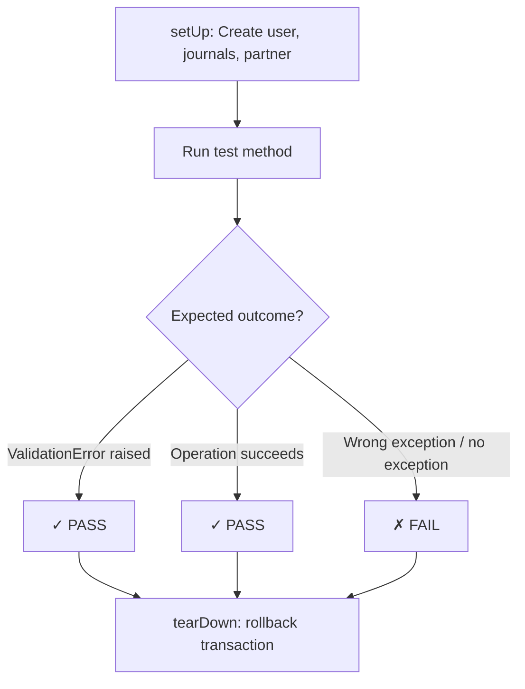

# Testing — el_restrict_journal

## 1. Test Plan

| # | Test Method | What it Tests | Automatable? |
|---|-------------|---------------|--------------|
| 1 | `test_01_user_journal_ids_field` | journal_ids can be assigned | ✅ Yes |
| 2 | `test_02_move_create_blocked` | account.move create with restricted journal → ValidationError | ✅ Yes |
| 3 | `test_03_move_write_blocked` | account.move write switching to restricted journal → ValidationError | ✅ Yes |
| 4 | `test_04_payment_create_blocked` | account.payment create with restricted journal → ValidationError | ✅ Yes |
| 5 | `test_05_payment_write_blocked` | account.payment write switching to restricted journal → ValidationError | ✅ Yes |
| 6 | `test_06_admin_not_restricted` | Admin user (empty journal_ids) NOT blocked | ✅ Yes |
| 7 | `test_07_move_create_allowed` | account.move create with non-restricted journal succeeds | ✅ Yes |
| 8 | `test_08_payment_create_allowed` | account.payment create with non-restricted journal succeeds | ✅ Yes |
| 9 | `test_09_multi_journal_restriction` | User with 2+ restricted journals blocked on all | ✅ Yes |
| 10 | `test_10_privilege_escalation_prevented` | Non-manager cannot edit own journal_ids | ✅ Yes |
| 11 | `test_11_constrains_layer` | @api.constrains catches violations | ✅ Yes |
| 12 | `test_12_record_rule_read_allowed` | Restricted user can still READ restricted journal | ✅ Yes |
| 13 | `test_13_record_rule_write_blocked` | Restricted user CANNOT WRITE to restricted journal | ✅ Yes |

## 2. Test Execution Flow



## 3. Running Tests

```bash
# Drop and recreate test DB
psql -U odoo -d postgres -c "DROP DATABASE IF EXISTS restrict_journal_db;"
psql -U odoo -d postgres -c "CREATE DATABASE restrict_journal_db OWNER odoo;"

# Run tests
odoo -d restrict_journal_db \
  -i el_restrict_journal \
  --test-enable --test-tags=/el_restrict_journal \
  --stop-after-init \
  --without-demo=False \
  --addons-path=<your addons path>
```

## 4. Test Results (L2)

| Run | Date | Result |
|-----|------|--------|
| L2 | 2026-07-14 | ✅ 13/13 PASS (0 failed, 0 errors) |

## 5. Coverage Analysis

| Requirement (from requirements-spec.md §9) | Test Method | Status |
|---------------------------------------------|-------------|--------|
| 1. res.users.journal_ids field | test_01 | ✅ Covered |
| 2. Block account.move create | test_02 | ✅ Covered |
| 3. Block account.move write | test_03 | ✅ Covered |
| 4. Block account.payment create | test_04 | ✅ Covered |
| 5. Block account.payment write | test_05 | ✅ Covered |
| 6. Journal record rule (unrestricted) | test_12 | ✅ Covered |
| 7. Journal record rule (restricted) | test_13 | ✅ Covered |
| 8. Account.move record rule | (covered via tests 2,3,7) | ✅ Covered |
| 9. Account.payment record rule | (covered via tests 4,5,8) | ✅ Covered |
| 10. Admin not restricted | test_06 | ✅ Covered |
| 11. onchange UX | (manual — requires browser) | ⚠ Manual |
| 12. Multi-journal restriction | test_09 | ✅ Covered |
| 13. Group membership enforcement | test_10 | ✅ Covered |

**Coverage:** 12/13 requirements automatically tested (92%). Requirement 11 (onchange UX) requires interactive browser testing — covered manually via the user-acceptance-preview.
