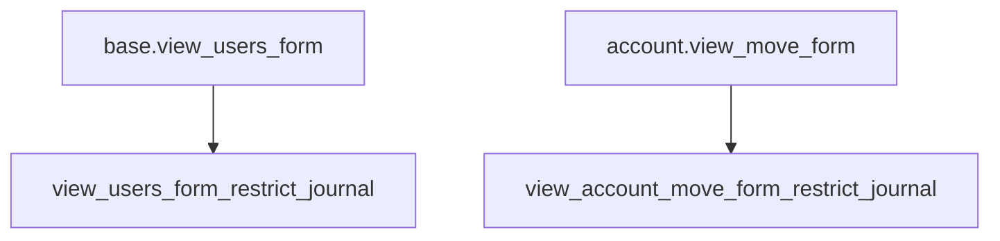
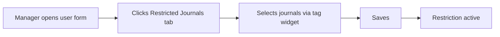

# Views — el_restrict_journal

## 1. res.users form (inherit)

Inherits `base.view_users_form`, adds a new "Restricted Journals" page to the notebook.

```xml
<xpath expr="//notebook" position="inside">
    <page string="Restricted Journals" name="restricted_journals"
          groups="el_restrict_journal.group_restrict_journal_manager">
        <group>
            <field name="journal_ids" widget="many2many_tags"
                   options="{'no_create': True, 'no_create_edit': True}"/>
        </group>
    </page>
</xpath>
```

## 2. account.move form (inherit)

Inherits `account.view_move_form`, ensures the journal_id field has `no_create` option (so users cannot create new journals from the move form).

## View Architecture



## UX Flow


