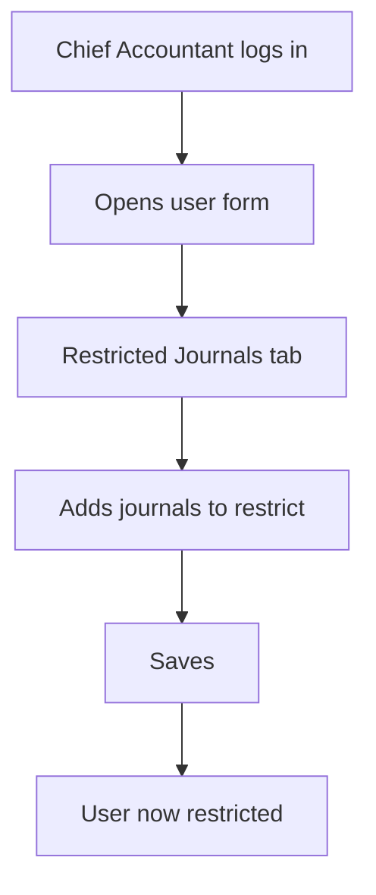
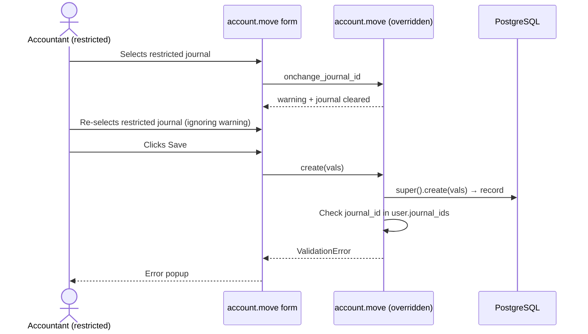
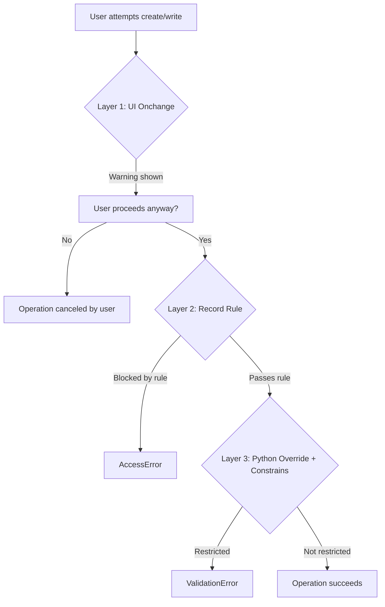
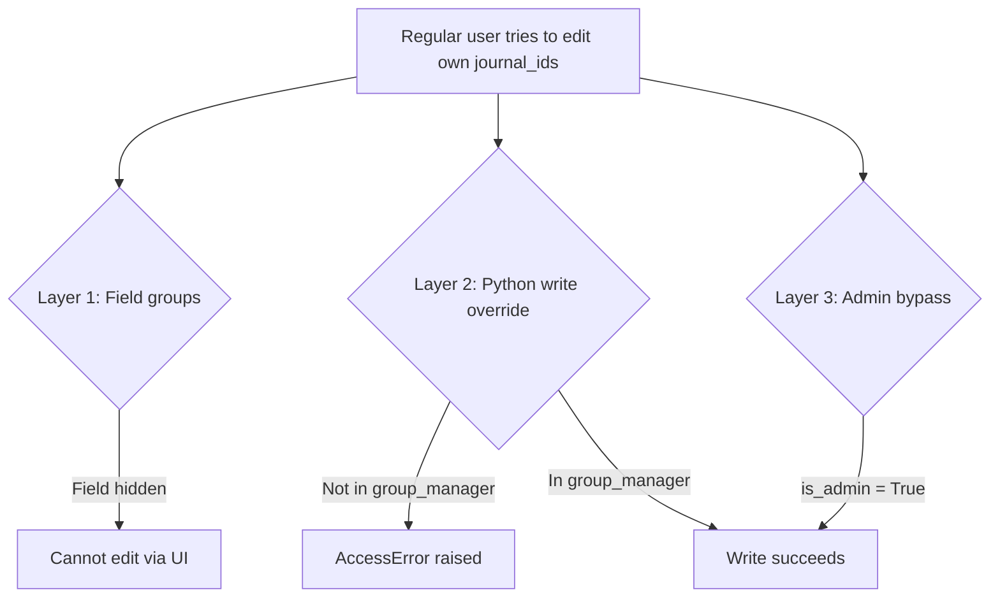

# Workflows — el_restrict_journal

## 1. Configuration Workflow

```mermaid
flowchart TD
    A[Chief Accountant logs in] --> B[Opens user form]
    B --> C[Restricted Journals tab]
    C --> D[Adds journals to restrict]
    D --> E[Saves]
    E --> F[User now restricted]
```

## 2. account.move Create (Restricted)

```mermaid
sequenceDiagram
    actor User as Accountant (restricted)
    participant UI as account.move form
    participant AM as account.move (overridden)
    participant DB as PostgreSQL

    User->>UI: Selects restricted journal
    UI->>AM: onchange_journal_id
    AM-->>UI: warning + journal cleared
    User->>UI: Re-selects restricted journal (ignoring warning)
    User->>UI: Clicks Save
    UI->>AM: create(vals)
    AM->>DB: super().create(vals) → record
    AM->>AM: Check journal_id in user.journal_ids
    AM-->>UI: ValidationError
    UI-->>User: Error popup
```

## 3. Defense-in-Depth Workflow

```mermaid
flowchart TD
    A[User attempts create/write] --> B{Layer 1: UI Onchange}
    B -->|Warning shown| C[User proceeds anyway?]
    C -->|No| D[Operation canceled by user]
    C -->|Yes| E{Layer 2: Record Rule}
    E -->|Blocked by rule| F[AccessError]
    E -->|Passes rule| G{Layer 3: Python Override + Constrains}
    G -->|Restricted| H[ValidationError]
    G -->|Not restricted| I[Operation succeeds]
```

## 4. Privilege Escalation Prevention

```mermaid
flowchart TD
    A[Regular user tries to edit own journal_ids] --> B{Layer 1: Field groups}
    B -->|Field hidden| C[Cannot edit via UI]
    A --> D{Layer 2: Python write override}
    D -->|Not in group_manager| E[AccessError raised]
    D -->|In group_manager| F[Write succeeds]
    A --> G{Layer 3: Admin bypass}
    G -->|is_admin = True| F
```
