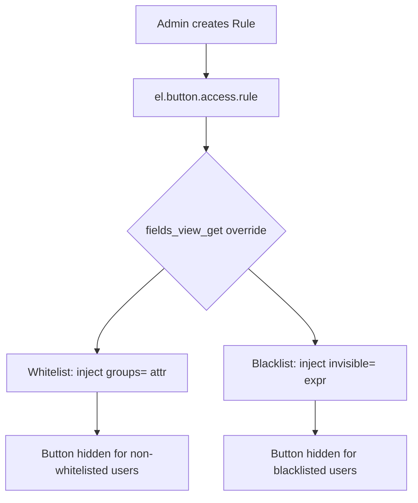
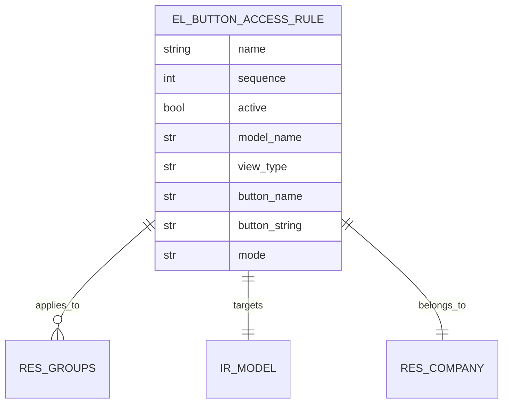
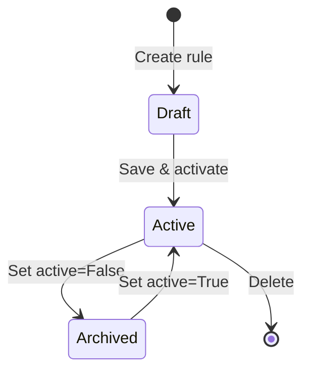

# Button Access Control

> **Module:** `el_button_access_control`
> **Version:** 19.0.1.0.0
> **License:** LGPL-3
> **Author:** Built with odoo-build-master v1.1.0

Dynamically control which buttons appear or disappear for specific user groups
in any Odoo view — **WITHOUT modifying the original view XML**.

## Architecture Overview



## Key Features

- **Show buttons only to specific groups** (whitelist mode)
- **Hide buttons from specific groups** (blacklist mode)
- **Apply to form, list, kanban, or all views**
- **Works with any model** — no code changes needed in target modules
- **Admin-friendly UI** for managing rules
- **Real-time test** button to verify rule behavior
- **Multi-company support**

## Installation

1. Copy `el_button_access_control/` to your Odoo **addons path**.
2. Restart Odoo.
3. Go to **Apps → Update Apps List**.
4. Search for *Button Access Control* and click **Install**.

## Configuration

### 1. Assign Security Groups

Go to **Settings → Users → Select User → Access Rights** tab.
Assign one of:
- **Button Access: User** — can view rules (read-only)
- **Button Access: Manager** — can create/edit/delete rules

### 2. Create a Rule

Go to **Button Access Control → Rules → New**.

Fill in:
| Field | Example | Description |
|-------|---------|-------------|
| Rule Name | "Hide Approve Button from Officers" | Descriptive name |
| Target Model | Sale Order | Which model to affect |
| View Type | Form View | Which view type |
| Button Method Name | `action_approve` | The technical method name |
| Mode | Hide from These Groups | Whitelist or Blacklist |
| Groups | Sales: Officer | Which groups are affected |

### 3. Test the Rule

Click the **Test Rule** button in the rule form to verify it's working.

## How It Works

The module overrides `fields_view_get` on the `base` abstract model (which
ALL Odoo models inherit from). Before any view is rendered:

1. **Check for active rules** matching the current model and view type
2. **Parse the view arch** as XML
3. **For whitelist rules** (`show_only`):
   - Inject `groups="group1,group2"` on matching `<button>` elements
   - Odoo natively hides the button for users not in those groups
4. **For blacklist rules** (`hide_from`):
   - Inject `invisible="user.has_group('group1') or user.has_group('group2')"` 
   - Odoo evaluates this per-user at render time
5. **Return the modified arch** to the view renderer

## ER Diagram



## State Machine



## Usage Example

### Scenario: Hide "Delete" button from Sales Officers

1. Create a rule:
   - **Name:** Hide Delete from Officers
   - **Model:** Sales Order (`sale.order`)
   - **View Type:** Form View
   - **Button Method Name:** `unlink` (or `action_cancel`)
   - **Mode:** Hide from These Groups
   - **Groups:** Sales / Officer

2. Save the rule.

3. Login as a Sales Officer → open a Sales Order → the Delete button is hidden.

4. Login as a Sales Manager → the Delete button is visible.

## Testing

```bash
odoo-bin -c odoo.cfg --test-enable --test-tags=/el_button_access_control \
    -i el_button_access_control --stop-after-init
```

The test suite covers 22 test methods across:
- Rule creation and validation
- Whitelist and blacklist modes
- View type filtering
- Active/inactive toggle
- Multi-rule interaction
- Cache clearing on CRUD operations

## Limitations

- **Blacklist mode uses `user.has_group()`** in the `invisible` attribute.
  This works in Odoo 17+ but may have minor performance impact on very
  large views with many blacklist rules.
- **The module clears the view cache** on rule changes. This is intentional
  to ensure rules take effect immediately, but may cause a one-time view
  reload delay.
- **Rules match by method name**, not by button label. If two buttons call
  the same method, both will be affected.

## Documentation

Full documentation lives under `docs/`:
- [Architecture](docs/architecture.md)
- [Security](docs/security.md)
- [Testing](docs/testing.md)
- [Configuration](docs/configuration.md)
- [Build Report](docs/build-report.md)
