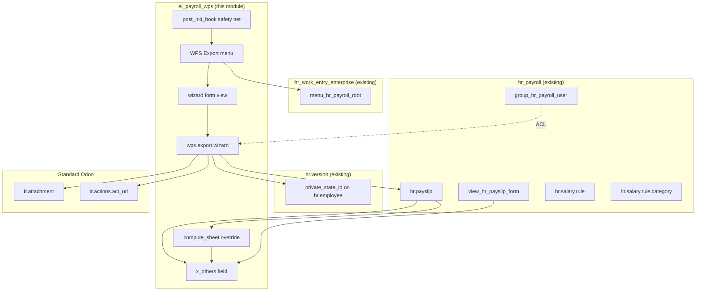
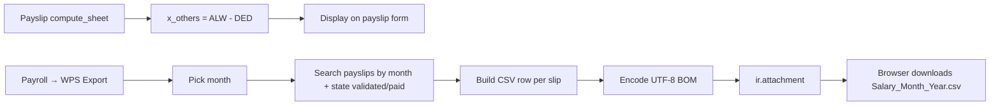

# Architecture — el_payroll_wps

## 1. Module Philosophy
- **Minimal footprint:** 1 inherited model + 1 new TransientModel + 1 wizard form + 1 inherited form view.
- **Zero configuration:** no settings page, no parameters, no cron jobs.
- **Idiomatic Odoo 19:** uses `primary_bank_account_id`, `private_state_id`, `validated`/`paid` states, `HOUALLOW` housing code, no `attrs=`, no `_sql_constraints`.

## 2. Component Map



## 3. File Map

```
el_payroll_wps/
├── __init__.py              ← post_init_hook safety net
├── __manifest__.py          ← depends + data[]
├── models/
│   └── hr_payslip.py        ← x_others + 4 methods
├── wizard/
│   ├── wps_export_wizard.py ← CSV builder
│   └── wps_export_wizard_views.xml
├── views/
│   └── hr_payslip_views.xml ← inherit (adds x_others after note)
├── security/
│   └── ir.model.access.csv  ← ACL
├── i18n/
│   └── ar.po                ← Arabic translations
├── static/description/
│   └── icon.png             ← 256×256
├── tests/
│   └── test_wps_export.py   ← 19 tests
└── docs/                    ← this documentation
```

## 4. Data Flow Summary



## 5. Architecture Decisions

| Decision | Chosen | Alternative | Rationale |
|----------|--------|-------------|-----------|
| Field name | `x_others` | `others` | Honor user's spec; `x_` prefix marks custom fields |
| Compute mechanism | Explicit call from `compute_sheet()` | `@api.depends` | `@api.depends` would overwrite manual edits on every form save |
| Wizard vs Server Action | TransientModel wizard | `ir.actions.server` | Server actions can't ask user for month input |
| Menu parent | Static xmlid + `post_init_hook` safety net | Hardcoded `hr_payroll.menu_hr_payroll_root` | O19 root menu xmlid lives in `hr_work_entry_enterprise` |
| Encoding | `utf-8-sig` (BOM) | Plain `utf-8` | Excel opens Arabic correctly only with BOM |
| Address field | `private_state_id` (O19) | `address_home_id` (removed) | Per user's correct O19 spec |
| Bank account | `primary_bank_account_id` (O19) + fallback | `bank_account_id` (renamed) | Per user's correct O19 spec + defensive |
| Payslip states | `validated`/`paid` (O19) | `done`/`paid` (≤18) | Per user's correct O19 spec |
| Housing rule code | `HOUALLOW` | `HOUSE` | Per user's correct spec |
| Discount sign | Positive (`200`) | Negative (`-200`) | Per user's corrected spec |
| Filename prefix | `Salary_` | `WPS_` | Per user's corrected spec |

## 6. References
- `docs/architecture/model-design.md` — model fields and methods
- `docs/architecture/state-machine-design.md` — (no state machines)
- `docs/architecture/dependencies-map.md` — depends
- `docs/architecture/data-flow.md` — detailed flow
- `docs/architecture/impact-analysis.md` — DB, performance, upgrade
- `docs/architecture/gap-analysis.md` — what we built vs what Odoo provides
- `docs/architecture/alignment-decision.md` — user requirements vs implementation
- `docs/architecture/creative-design.md` — design lenses applied
- `docs/architecture/security-review.md` — security analysis
- `docs/architecture/performance-review.md` — performance analysis
- `docs/architecture/_inventories.md` — 4 inventories
