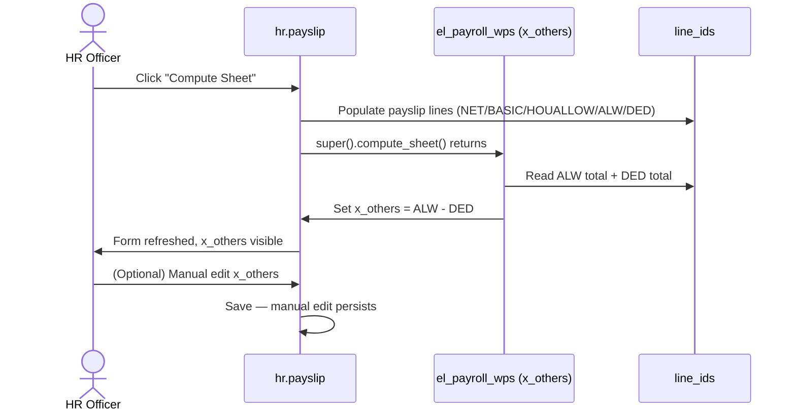
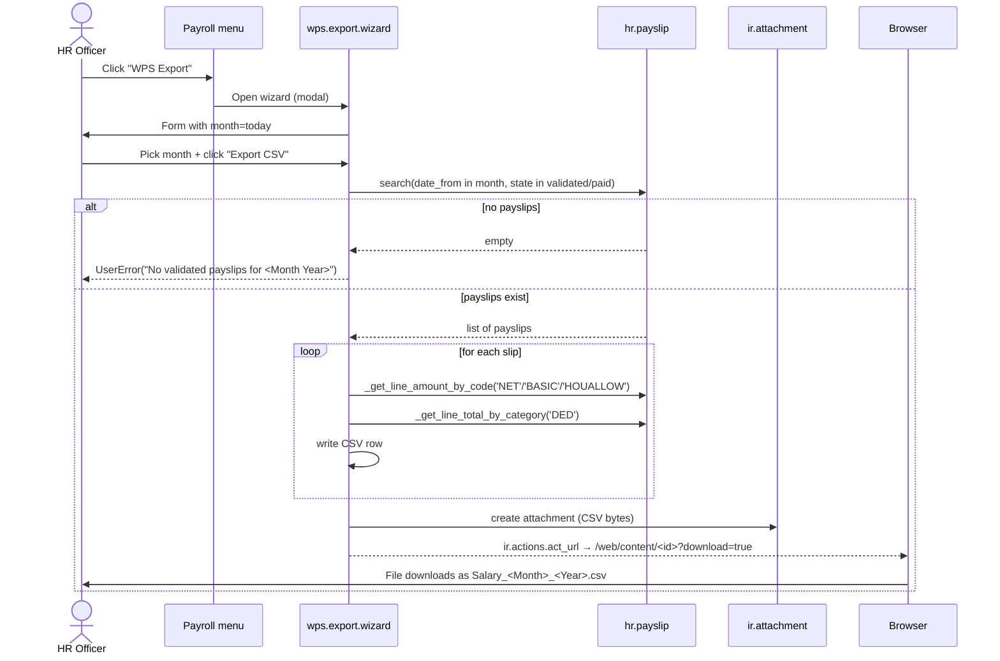
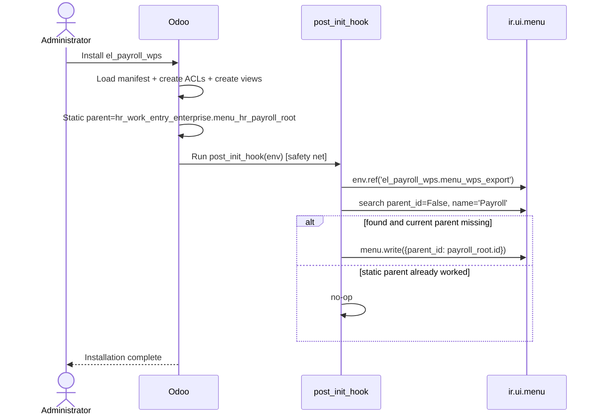

# Workflows — el_payroll_wps

## 1. Payslip Computation Workflow

## 2. Monthly WPS Export Workflow

## 3. Module Installation Workflow

## 4. State Machines

**No state machines in this module.** `hr.payslip` has its own (`draft → verify → validated → paid → cancel`) but we don't modify it. The wizard is a single-step transient.
