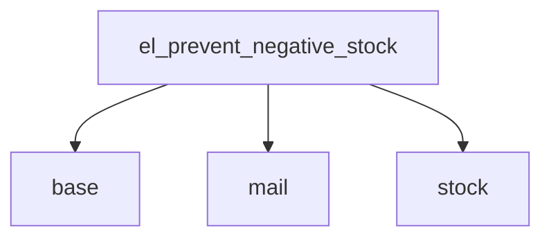

# GAP Analysis Report

**Module:** `el_prevent_negative_stock`
**Date:** 2026-07-13T20:19:30.337151

## Requirement → Module Mapping

| # | Requirement | Module | Coverage | Action |
|---|-------------|--------|----------|--------|
| 1 | stock management | `stock` | ✅ Full | ⚙️ Config |
| 2 | inventory control | `stock` | ✅ Full | ⚙️ Config |
| 3 | stock moves | `stock` | ✅ Full | ⚙️ Config |
| 4 | email notifications | `mail` | ✅ Full | ⚙️ Config |
| 5 | multi-company | `base` | ✅ Full | ⚙️ Config |

## Build Scope

### Config only: 5
- stock management
- inventory control
- stock moves
- email notifications
- multi-company

### Custom build: 0

## Dependencies

- `base`
- `mail`
- `stock`

## Effort reduction: 100%

