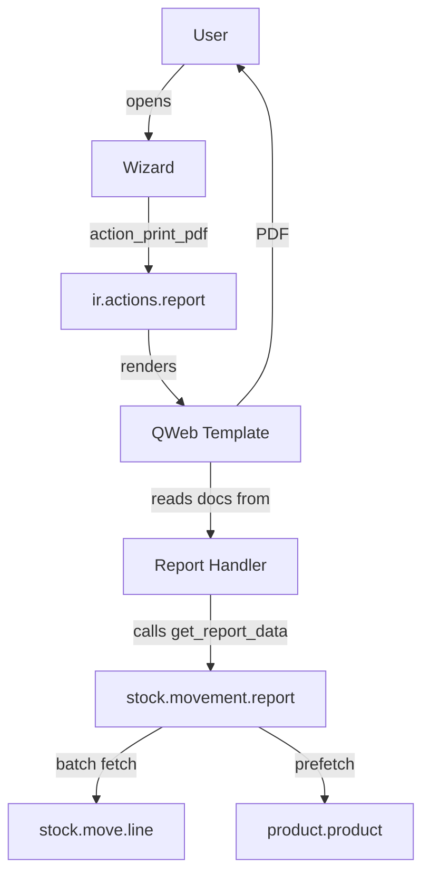
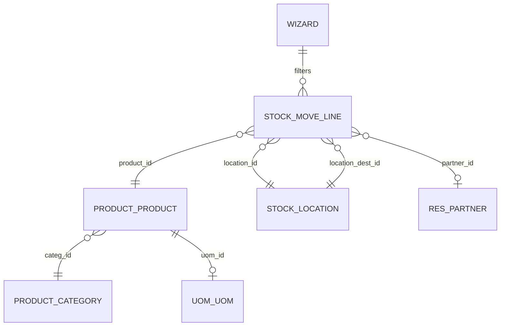
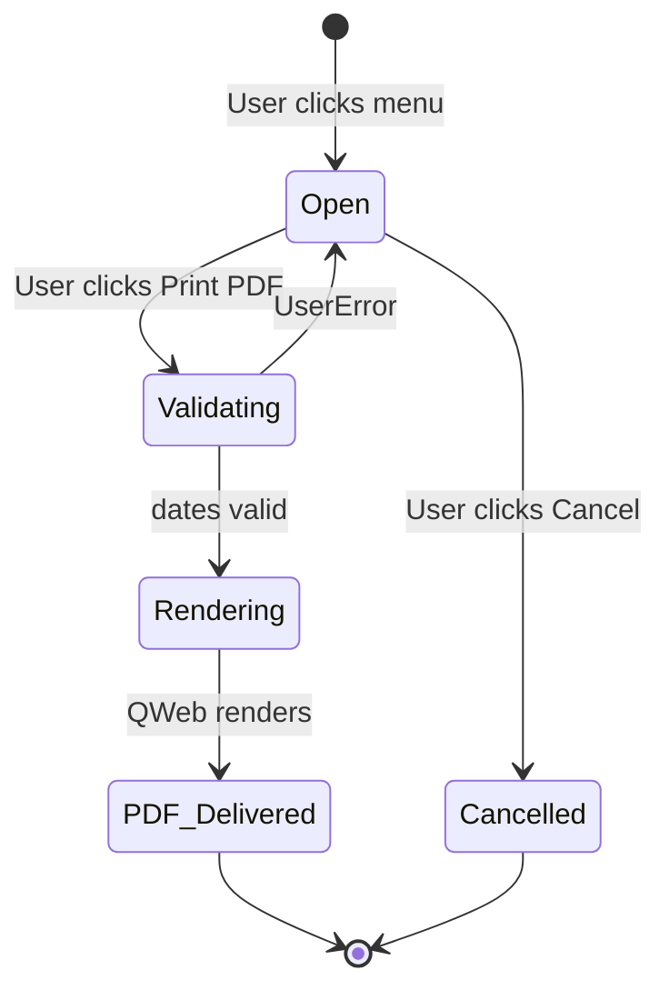

# Stock Movement Report (ie_stock_movement_report)

**Version:** 19.0.1.0.0
**Author:** Ibrahim Elmasry
**License:** LGPL-3
**Requires:** Odoo 19.0+ with `stock` and `stock_account`

## Overview

Generates a PDF report of inventory movements per product during a selected
period. Each product gets its own page with:

- Opening Balance (qty + value)
- Detailed movement table (Date, Reference, Partner, Source, Destination,
  IN/OUT/BALANCE — each split into Qty/Unit/Unit Price/Total)
- Running balance after every transaction
- Product Summary (Opening Qty, Total In, Total Out, Closing Qty,
  Inventory Value)

## Architecture Overview



## ER Diagram



## Wizard Lifecycle (State Machine)



## Installation

```bash
# Copy the module to your Odoo addons path
cp -r ie_stock_movement_report /path/to/odoo/addons/

# Install via Odoo CLI
./odoo-bin -c odoo.conf -d your_db -i ie_stock_movement_report

# Or via the UI: Apps → search "Stock Movement Report" → Install
```

## Usage

1. Go to **Inventory → Reporting → Stock Movement Report**
2. The wizard opens with:
   - **From Date** (required)
   - **To Date** (required)
   - **Warehouse** (optional)
   - **Location** (optional)
   - **Product** (optional)
   - **Product Category** (optional)
3. Click **Print PDF**
4. The report opens in a new tab with one page per product

## Report Layout

- **Paper:** A4 Landscape
- **Orientation:** Landscape
- **Header:** Company logo + name + report name + date range + page number
- **Footer:** Page number
- **One product per page** (page break after each product)

## Performance

Designed for thousands of movements:

- **Single batch fetch** of `stock.move.line` records with domain filter
- **Separate batch fetch** for opening balance (date < from_date)
- **Prefetched product data** (cost, uom, category) via one `read()` call
- **Prefetched partner/location names** via `display_name` (single SQL)
- **In-memory balance computation** — no ORM calls inside the movement loop
- **Group-by product** via `defaultdict` after the single fetch

For a report with 10,000 move lines, expect rendering time under 5 seconds.

## Multi-language Support

- **English (LTR)** — default
- **Arabic (RTL)** — switch user language to Arabic; the report layout
  flips automatically thanks to QWeb + wkhtmltopdf RTL handling
- All strings wrapped in `_()` for translation
- `i18n/ar.po` ships 44 Arabic translations

## Security

Two security groups:

- **Stock Movement Report: User** — can run the report
- **Stock Movement Report: Manager** — can run + delete stuck wizards

Both imply the standard `stock.group_stock_user` group.

## Files

```
ie_stock_movement_report/
├── __init__.py
├── __manifest__.py
├── README.md
├── models/
│   ├── __init__.py
│   └── stock_movement_report.py        # Business logic + Wizard (cohesive)
├── wizard/
│   ├── __init__.py
│   └── stock_movement_report_wizard_views.xml
├── reports/
│   ├── __init__.py
│   ├── stock_movement_report.py        # QWeb report handler
│   └── stock_movement_report_template.xml  # QWeb template + paperformat
├── security/
│   ├── ir.module.privilege.xml         # Odoo 19 privilege pattern
│   └── ir.model.access.csv
├── views/
│   └── stock_movement_report_menu.xml
├── tests/
│   ├── __init__.py
│   ├── test_stock_movement_report.py   # 14 test methods
│   └── test_permissions.py             # 4 test methods
├── i18n/
│   └── ar.po                           # 44 Arabic translations
├── static/
│   └── description/
│       └── icon.png                    # 256x256 purple (Inventory category)
└── docs/                               # 13 documentation files
    ├── stakeholder-analysis.md
    ├── security.md
    ├── testing.md
    ├── icon-design.md
    └── architecture/
        ├── _inventories.md
        ├── model-design.md
        ├── state-machine-design.md
        ├── dependencies-map.md
        ├── data-flow.md
        ├── impact-analysis.md
        ├── gap-analysis.md
        ├── alignment-decision.md
        └── creative-design.md
```

## Calculation Rules

### Opening Balance

Sum of all `stock.move.line` quantities **before** `From Date`:

- `+ qty_done` if `location_dest_id` is in scope (incoming)
- `- qty_done` if `location_id` is in scope (outgoing)
- Net 0 if both source and destination are in scope (internal move)

### Running Balance

```
running_qty = previous_qty + in_qty - out_qty
```

### Closing Balance

```
closing_qty = opening_qty + total_in - total_out
```

### Inventory Value

```
inventory_value = closing_qty × product.standard_price
```

## Dependencies

- `base` — res.company, res.users
- `stock` — stock.move.line, stock.location, stock.warehouse
- `stock_account` — product.standard_price (Community Edition)
- `web` — QWeb report infrastructure

## Compliance

Built following the `odoo-master` skill v10.30.3 BUILD MODE workflow:

- **LAW 6:** Modern Odoo 19 patterns (`<list>`, `invisible=`, no `attrs=`)
- **LAW 11/14:** Uses `ir.module.privilege` (Odoo 19) for security groups
- **LAW 13:** Module name prefixed with `ie_`
- **LAW 16:** Manifest `data[]` in correct order (security → wizard → reports → views → menus)
- **LAW 19:** QWeb follows Odoo 19 pattern (t-foreach between html_container and external_layout, `o.` not `object.`, `t-options` not `t-field-options`, `<td>` content wrapped in `<span>`)

## Author

**Ibrahim Elmasry**
- GitHub: https://github.com/Elmasry-631
- Email: ibrahim.elmasry@gmail.com
