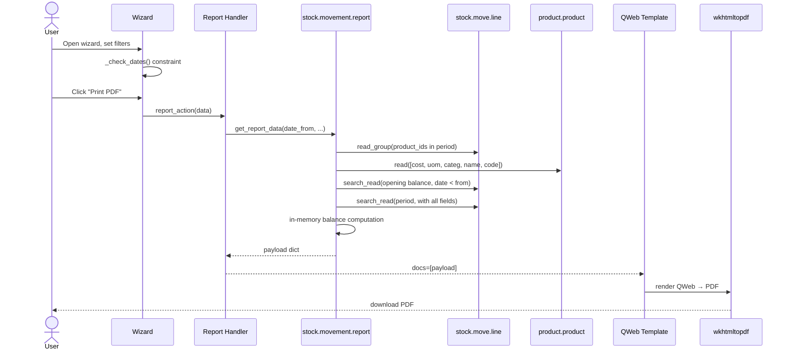

# Data Flow — ie_stock_movement_report

## End-to-end data flow

## Performance strategy

1. **ONE query** for product IDs in period (read_group)
2. **ONE query** for product data (read() on small set)
3. **ONE query** for opening balance (search_read with date < from_date)
4. **ONE query** for period move lines (search_read with date in [from, to])
5. **TWO queries** for partner + location names (display_name prefetch)
6. **In-memory** defaultdict grouping + running balance computation

Total: ~6 SQL queries regardless of movement count. No ORM calls in loops.
