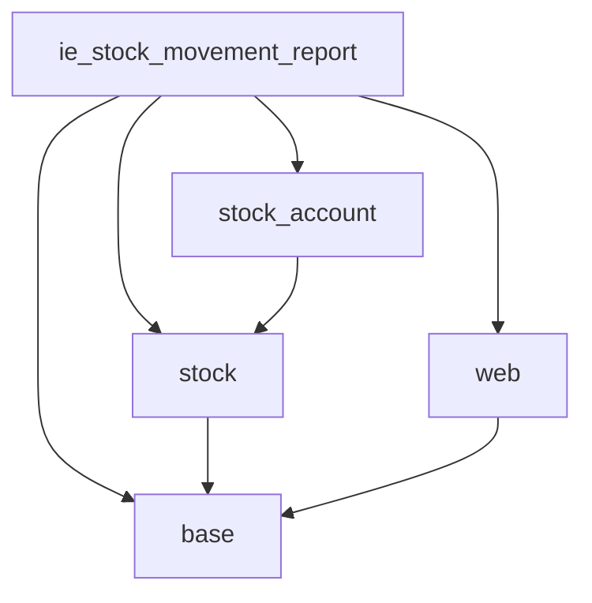

# Dependencies Map — ie_stock_movement_report

## Module Dependencies

| Module          | Why needed                                            |
|-----------------|-------------------------------------------------------|
| `base`          | Required for all modules; res.company, res.users     |
| `stock`         | stock.move.line, stock.location, stock.warehouse     |
| `stock_account` | stock.valuation.layer, product.standard_price        |
| `web`           | QWeb report infrastructure (web.html_container, external_layout) |

## Why NOT depend on

| Module           | Reason                                                   |
|------------------|----------------------------------------------------------|
| `stock_account_pond` | Enterprise-only — we use standard_price (Community)  |
| `mrp`            | Not needed — report reads move lines regardless of source |
| `purchase`       | Not needed — partners are read via res.partner           |
| `sale`           | Not needed — same reason                                 |

## External data sources

- `stock.move.line` — single batch `search_read()` with date + scope filter
- `product.product` — `read()` for cost, uom, category, name, code
- `res.partner` — `display_name` prefetch (no N+1)
- `stock.location` — `display_name` prefetch (no N+1)
- `stock.warehouse` — single browse for lot_stock_id

## Dependency Graph

