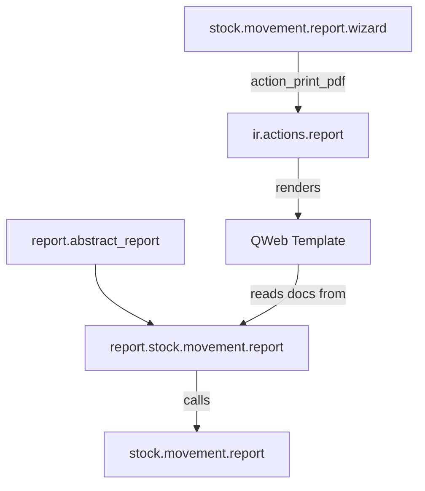

# Model Design — ie_stock_movement_report

## Models

### stock.movement.report (AbstractModel)
- **_name:** `stock.movement.report`
- **_description:** Stock Movement Report (abstract data provider)
- **Why AbstractModel:** The report is rendered from a wizard — no records
  persist. Using AbstractModel avoids unnecessary DB tables.
- **Inherits:** none
- **Key method:** `get_report_data()` returns a payload dict consumed by QWeb.

### stock.movement.report.wizard (TransientModel)
- **_name:** `stock.movement.report.wizard`
- **_description:** Stock Movement Report Wizard
- **Why TransientModel:** Wizards are short-lived — auto-cleaned by Odoo.
- **Fields:** 6 (see _inventories.md)
- **Constraint:** `date_from <= date_to`

### report.stock.movement.report (AbstractModel)
- **_inherit:** `report.abstract_report`
- **_template:** `ie_stock_movement_report.report_stock_movement_document`
- **Purpose:** QWeb data provider — calls `stock.movement.report.get_report_data()`.

## Inheritance Diagram

## Field/Method Inventory Reference

See `_inventories.md` for the complete field and method tables.

## Why no mail.thread

The wizard and abstract models are transient/stateless — no chatter needed.
