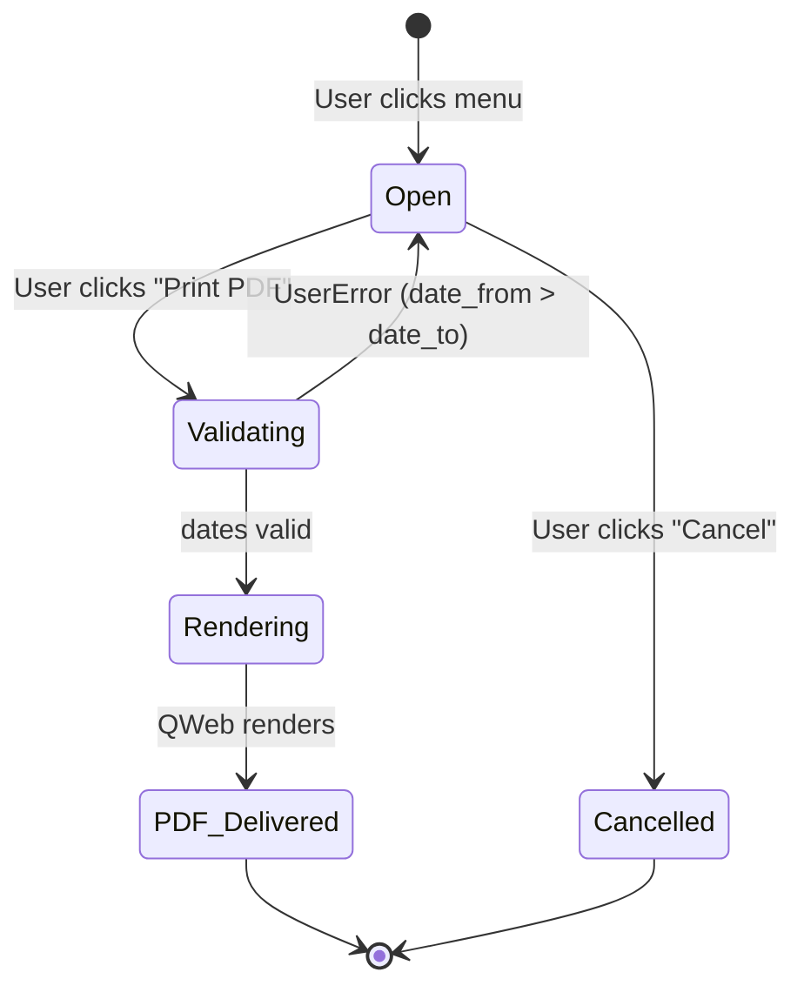
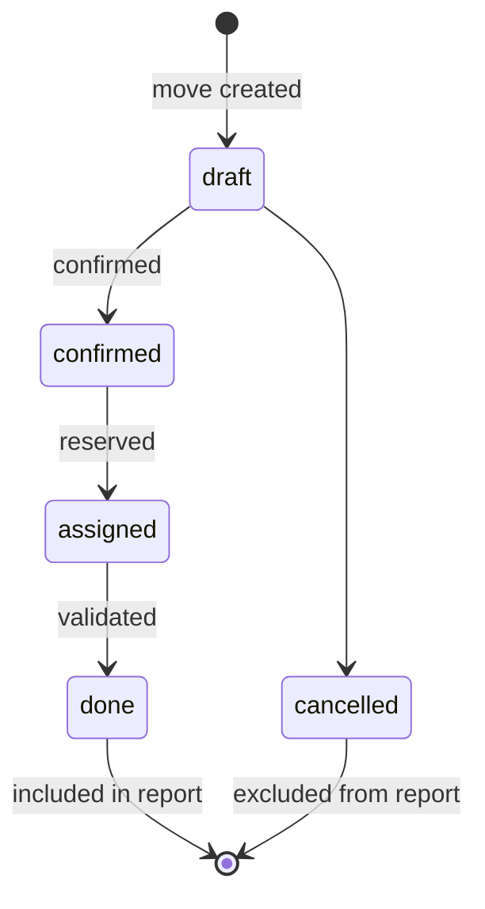

# State Machine Design — ie_stock_movement_report

## No state machine required

This module has no persisted business records with state transitions. The
wizard is a transient form that opens, collects filters, and triggers a PDF.

## Wizard Lifecycle

## Stock Move Line State (consumed, not modified)

The report reads `stock.move.line` records in state `done` only:

Only `done` state lines are included — `draft`, `confirmed`, `assigned`,
`cancelled` are excluded via the domain filter `('state', '=', 'done')`.
