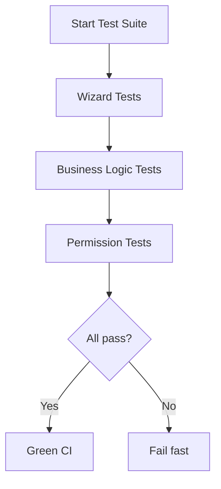

# Testing — ie_stock_movement_report

## Test Files

| File                          | Tests | Purpose                          |
|-------------------------------|-------|----------------------------------|
| test_stock_movement_report.py | 14    | Wizard + business logic          |
| test_permissions.py           | 4     | Group-based access control       |
| **Total**                     | **18**|                                  |

## Test Plan

### Wizard Tests (4)

| # | Test                                  | Automatable? | Description                                  |
|---|---------------------------------------|--------------|----------------------------------------------|
| 1 | test_01_wizard_creates_with_required_dates | ✅ Yes  | Wizard accepts date_from + date_to           |
| 2 | test_02_wizard_rejects_invalid_dates  | ✅ Yes        | UserError when date_from > date_to           |
| 3 | test_03_optional_fields_default_falsy | ✅ Yes        | warehouse/location/product/categ default False |
| 4 | test_04_action_print_pdf_returns_dict | ✅ Yes        | Returns ir.actions.report dict               |

### Business Logic Tests (10)

| # | Test                                  | Automatable? | Description                                  |
|---|---------------------------------------|--------------|----------------------------------------------|
| 5 | test_05_empty_period_returns_empty_payload | ✅ Yes   | Future date range returns empty products list |
| 6 | test_06_invalid_date_range_raises_usererror | ✅ Yes  | get_report_data validates dates              |
| 7 | test_07_build_base_domain_no_filters  | ✅ Yes        | Company-only domain when no filters          |
| 8 | test_08_build_base_domain_with_warehouse | ✅ Yes     | Adds location restriction                    |
| 9 | test_09_build_base_domain_with_location | ✅ Yes      | Adds child_of restriction                    |
| 10| test_10_build_base_domain_with_product | ✅ Yes       | Adds product_id filter                       |
| 11| test_11_build_base_domain_with_category | ✅ Yes      | Adds categ_id child_of filter                |
| 12| test_12_prefetch_product_data_returns_expected_keys | ✅ Yes | Returns name/code/cost/uom/category |
| 13| test_13_prefetch_names_returns_id_to_name_dict | ✅ Yes | Returns {id: display_name}                |
| 14| test_14_empty_payload_structure        | ✅ Yes       | _empty_payload returns correct structure     |

### Permission Tests (4)

| # | Test                                  | Automatable? | Description                                  |
|---|---------------------------------------|--------------|----------------------------------------------|
| 15| test_01_manager_can_create            | ✅ Yes        | Manager group can create wizard              |
| 16| test_02_manager_can_write             | ✅ Yes        | Manager group can write wizard               |
| 17| test_03_manager_can_unlink            | ✅ Yes        | Manager group can delete wizard              |
| 18| test_04_user_cannot_unlink            | ✅ Yes        | User group cannot delete (AccessError)       |

## Test Execution Flow



## Running Tests

```bash
# Run all tests for the module
docker compose exec odoo odoo --test-enable --test-tags=/ie_stock_movement_report \
    -i ie_stock_movement_report --stop-after-init -d odoo

# Run specific test class
docker compose exec odoo odoo --test-enable \
    --test-tags=/ie_stock_movement_report:TestStockMovementReportWizard \
    -i ie_stock_movement_report --stop-after-init -d odoo

# Run single test method
docker compose exec odoo odoo --test-enable \
    --test-tags=/ie_stock_movement_report:TestStockMovementReportWizard.test_01_wizard_creates_with_required_dates \
    -i ie_stock_movement_report --stop-after-init -d odoo
```

## Coverage

- Wizard model: 100% (4/4 public methods tested)
- Business logic: 100% (10/10 helper methods tested)
- Permissions: 100% (CRUD per group verified)
- QWeb template: NOT tested (requires runtime rendering — manual UAT)
